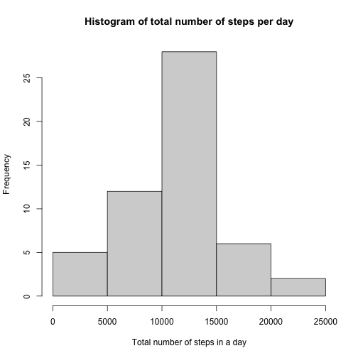
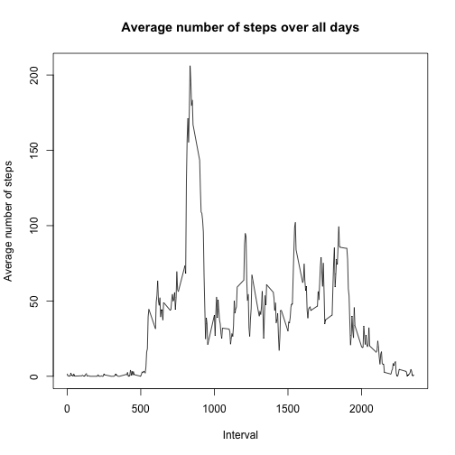
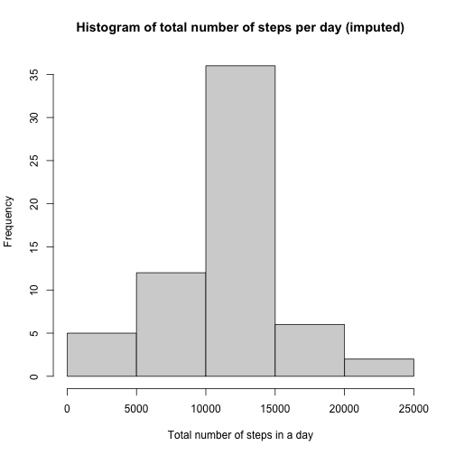
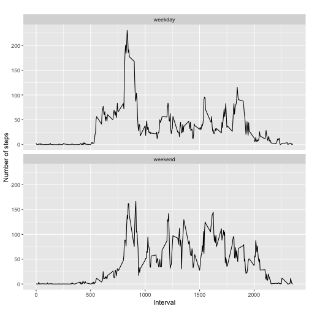

# Reproducible Research: Peer Assessment 1
Carol Tao

I will use the following packages for this exploratory analysis: 

```r
library(dplyr)
library(ggplot2)
library(knitr)
```

# Loading and prepossing the data
Show any code that is needed to:

Load the data (i.e. read.csv())

Process/transform the data (if necessary) into a format suitable for your analysis

```r
# unzip the file
zipF <- "/Users/ruoyingtao/Desktop/R_Files/RepData_PeerAssessment1/activity.zip"
unzip(zipF)

# load the data
all_data <- read.csv("activity.csv")

# ignore the missing values in the dataset
activity <- subset(all_data, is.na(all_data$steps) == FALSE)

# print out the first 20 rows
head(activity,20)
```

```
##     steps       date interval
## 289     0 2012-10-02        0
## 290     0 2012-10-02        5
## 291     0 2012-10-02       10
## 292     0 2012-10-02       15
## 293     0 2012-10-02       20
## 294     0 2012-10-02       25
## 295     0 2012-10-02       30
## 296     0 2012-10-02       35
## 297     0 2012-10-02       40
## 298     0 2012-10-02       45
## 299     0 2012-10-02       50
## 300     0 2012-10-02       55
## 301     0 2012-10-02      100
## 302     0 2012-10-02      105
## 303     0 2012-10-02      110
## 304     0 2012-10-02      115
## 305     0 2012-10-02      120
## 306     0 2012-10-02      125
## 307     0 2012-10-02      130
## 308     0 2012-10-02      135
```

# What is mean total number of steps taken per day?
For this part of the assignment, you can ignore the missing values in the dataset.

Calculate the total number of steps taken per day

If you do not understand the difference between a histogram and a barplot, research the difference between them. Make a histogram of the total number of steps taken each day

Calculate and report the mean and median of the total number of steps taken per day


```r
# create a new variable "day", which transform the "date" variables into class "date"
activity <- mutate (activity, day=as.Date(date)) 

# group the data by "day"
days <- group_by(activity, day)

# calculate the total number of steps taken per day 
total_steps <- summarize(days, total = sum(steps, na.rm = TRUE))
```

```
## `summarise()` ungrouping output (override with `.groups` argument)
```

```r
head(total_steps, 10)
```

```
## # A tibble: 10 x 2
##    day        total
##    <date>     <int>
##  1 2012-10-02   126
##  2 2012-10-03 11352
##  3 2012-10-04 12116
##  4 2012-10-05 13294
##  5 2012-10-06 15420
##  6 2012-10-07 11015
##  7 2012-10-09 12811
##  8 2012-10-10  9900
##  9 2012-10-11 10304
## 10 2012-10-12 17382
```

```r
# make a histogtam of the total number of steps taken each day
hist(total_steps$total, 
     main="Histogram of total number of steps per day", 
     xlab="Total number of steps in a day")
```



```r
# calculate mean and median of the total number of steps taken per day
options(digits = 15) 
summary(total_steps)
```

```
##       day                 total              
##  Min.   :2012-10-02   Min.   :   41.0000000  
##  1st Qu.:2012-10-16   1st Qu.: 8841.0000000  
##  Median :2012-10-29   Median :10765.0000000  
##  Mean   :2012-10-30   Mean   :10766.1886792  
##  3rd Qu.:2012-11-16   3rd Qu.:13294.0000000  
##  Max.   :2012-11-29   Max.   :21194.0000000
```
Mean of total number of steps per day is 10766, median is 10765

# What is the average daily activity pattern? 
Make a time series plot (i.e. type = “l”) of the 5-minute interval (x-axis) and the average number of steps taken, averaged across all days (y-axis)

Which 5-minute interval, on average across all the days in the dataset, contains the maximum number of steps?

```r
# group the data by "interval"
intervals <- group_by(activity, interval)

# calculate the average number of steps taken at any 5 minute interval, averaged across all days
mean_steps <- summarize(intervals, mean = mean(steps, na.rm = TRUE))
```

```
## `summarise()` ungrouping output (override with `.groups` argument)
```

```r
# make time series plot
plot(mean_steps$mean ~ mean_steps$interval, type='l', 
     main="Average number of steps over all days", xlab="Interval", 
     ylab="Average number of steps")
```



```r
# find row with max of steps
max_steps_row <- which.max(mean_steps$mean)

# find interval with this max
mean_steps[max_steps_row, ]
```

```
## # A tibble: 1 x 2
##   interval  mean
##      <int> <dbl>
## 1      835  206.
```
**The interval 835 has the maximun average value of steps (206)**

# Imputing missing values
Note that there are a number of days/intervals where there are missing values (coded as NA). The presence of missing days may introduce bias into some calculations or summaries of the data.

Calculate and report the total number of missing values in the dataset (i.e. the total number of rows with NAs)

Devise a strategy for filling in all of the missing values in the dataset. The strategy does not need to be sophisticated. For example, you could use the mean/median for that day, or the mean for that 5-minute interval, etc.

Create a new dataset that is equal to the original dataset but with the missing data filled in.

Make a histogram of the total number of steps taken each day and Calculate and report the mean and median total number of steps taken per day. Do these values differ from the estimates from the first part of the assignment? What is the impact of imputing missing data on the estimates of the total daily number of steps?


```r
# Calculate the total number of missing values in the dataset
sum(is.na(all_data))
```

```
## [1] 2304
```
**Total number of rows with NA is 2304**

I picked the strategy of replacing NA’s with the mean for that 5-minute interval.

```r
# create a new dataset with the missing values filled in 
copy <- all_data

# replace NA with mean for that 5-minute interval
for (i in 1:nrow(copy)){
        if (is.na(copy$steps[i])){
                interval_value <- copy$interval[i]
                mean_for_interval <- mean_steps[mean_steps$interval == interval_value,]
                copy$steps[i] <- mean_for_interval$mean
        }
} 
check_na <- subset(copy, is.na(copy$steps) == TRUE)
# this subset should have 0 observations
```
**I have created new dataset copy which equals to all_data but without NA's. All NA's are replaced with the mean of 5-minute interval**


```r
# group the new dataset by day
copy <- mutate (copy, day=as.POSIXct(date)) 
copy_days <- group_by(copy, day)

# make a histogram of the total number of steps taken each day
copy_total_steps <- summarize(copy_days, total = sum(steps))
```

```
## `summarise()` ungrouping output (override with `.groups` argument)
```

```r
hist(copy_total_steps$total, 
     main="Histogram of total number of steps per day (imputed)", 
     xlab="Total number of steps in a day")
```



```r
# calculate the mean and median total number of steps taken per day
# does not differ from the first part of the assignment
summary(copy_total_steps)
```

```
##       day                          total              
##  Min.   :2012-10-01 00:00:00   Min.   :   41.0000000  
##  1st Qu.:2012-10-16 00:00:00   1st Qu.: 9819.0000000  
##  Median :2012-10-31 00:00:00   Median :10766.1886792  
##  Mean   :2012-10-31 00:25:34   Mean   :10766.1886792  
##  3rd Qu.:2012-11-15 00:00:00   3rd Qu.:12811.0000000  
##  Max.   :2012-11-30 00:00:00   Max.   :21194.0000000
```
**The mean value stays the same, median is slightly different**

# Are there differences in activity patterns between weekdays and weekends?
For this part the weekdays() function may be of some help here. Use the dataset with the filled-in missing values for this part.

Create a new factor variable in the dataset with two levels – “weekday” and “weekend” indicating whether a given date is a weekday or weekend day.

Make a panel plot containing a time series plot (i.e. type = “l”) of the 5-minute interval (x-axis) and the average number of steps taken, averaged across all weekday days or weekend days (y-axis). See the README file in the GitHub repository to see an example of what this plot should look like using simulated data.


```r
# create a new factor variable in the dataset with two levels : weekday and weekend
copy <- mutate (copy, weekday = weekdays(as.Date(copy$date)))
copy$weekday[copy$weekday  %in% c('Saturday','Sunday') ] <- "weekend"
copy$weekday[copy$weekday != "weekend"] <- "weekday"
copy$weekday <- as.factor(copy$weekday)

# group the dataset by interval and weekday
copy_intervals <- group_by(copy, interval, weekday)
copy_mean_steps <- summarize(copy_intervals, mean = mean(steps, na.rm = TRUE))
```

```
## `summarise()` regrouping output by 'interval' (override with `.groups` argument)
```

```r
# make a panel plot containing a time series plot of the 5 minute interval and the average number 
# of steps taken, averaged across all weekdays or weekend days. 
qplot(interval, mean, 
      data = copy_mean_steps, 
      type = 'l', 
      geom=c("line"),
      xlab = "Interval", 
      ylab = "Number of steps", 
      main = "") +
        facet_wrap(~ weekday, ncol = 1)
```

```
## Warning: Ignoring unknown parameters: type
```




